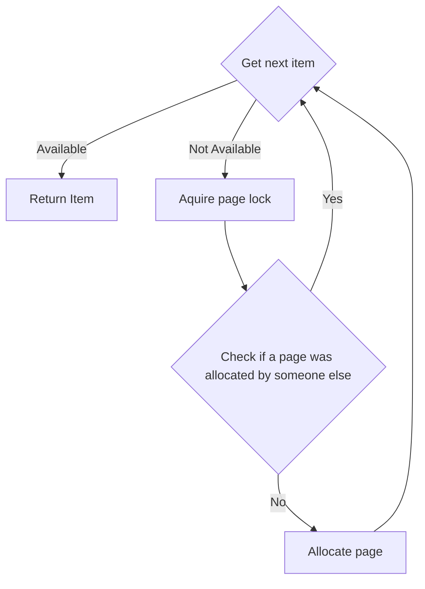
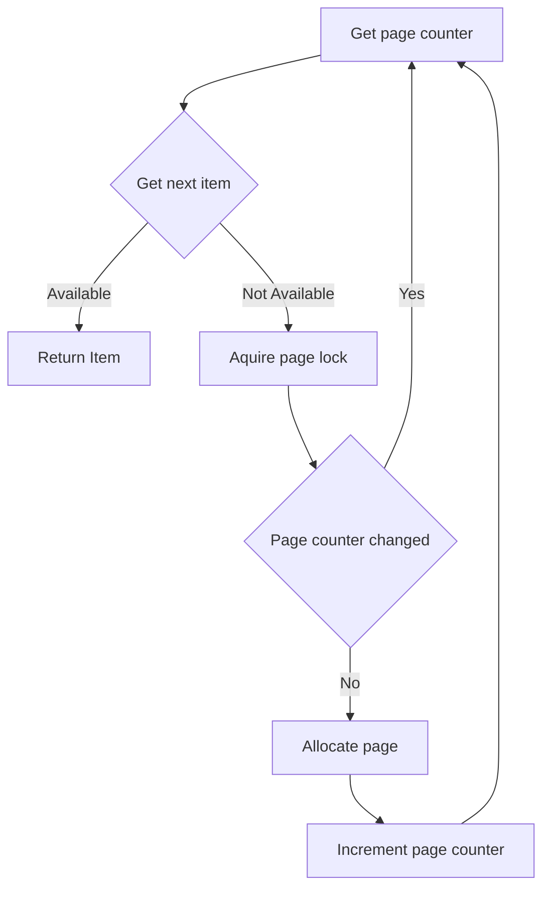

# Object Pool (C++)

[](https://github.com/andatr/object_pool/actions/workflows/linux.yml)
[](https://github.com/andatr/object_pool/actions/workflows/windows.yml)
[](https://github.com/andatr/object_pool/actions/workflows/macos.yml)

Object Pool is a thread-safe implementation of Simple Segregated Storage, designed for fast allocation of objects of the same type.

The Object Pool consists of a list of fixed-size pages, defined by the `PageSizeBytes` template argument.
Each page contains a predetermined number of items, which together form a lock-free stack of items available for allocation.
When an item is allocated, it is taken from the stack, and the constructor is called.
Conversely, when an item is deallocated, the destructor is called, and the item is returned to the stack.
If the stack is empty, a new page is allocated, and its items are added to the stack.
Item acquisition is lock-free, while the page allocation process occurs under a lock, as detailed in the description below.
Allocated pages are retained in memory until the pool is destroyed.
This optimization pattern is commonly used in standard containers like std::vector, minimizing allocation overhead and improving performance.

```
     ┌───────────┐  ┌────┐ ┌───┐ ┌───┐  ┌──────────┐  ┌────┐ ┌───┐ ┌───┐      
     │           ▼  │    ▼ │   ▼ │   ▼  │          ▼  │    ▼ │   ▼ │   ▼      
     │        ┌─────────────────────────────┐    ┌────────────────────────────┐
     │        │ ┌─────┐ ┌─────┐     ┌─────┐ │    │┌─────┐ ┌─────┐     ┌─────┐ │
Item Stack    │ │Item1│ │Item2│ ... │ItemN│ │    ││Item1│ │Item2│ ... │ItemN│ │
              │ └─────┘ └─────┘     └─────┘ │    │└─────┘ └─────┘     └─────┘ │
              │                             │    │                            │
Page List  ─► │          PAGE1              │ ─► │         PAGE2              │
              └─────────────────────────────┘    └────────────────────────────┘
```

## Features:

1. **Lock-free Allocation/Deallocation:** 
   - Object allocation and deallocation within existing pages are handled using a lock-free stack, ensuring high performance.
   - Page allocation requires locking.

2. **Constructor/Destructor Invocation:**
   - Each object allocation invokes its constructor, and each deallocation invokes its destructor.

3. **Alignment Handling:**  
   - Properly manages object alignment, ensuring compatibility with ARM architectures and types that require strict alignment on x86, such as __m128.

## Requirements:

- **C++20 or higher** is required.

## Page allocation algorithm:

**First approach**

Since item allocation is lock-free, there can be situations where a thread does not find an item to allocate, but another thread has allocated a new page just after that, and before the current thread requests a new page.
The easiest solution would be to make the page list a lock-free structure as well, allowing both threads to allocate a page, which would mean we now have two new empty pages instead of just one.
However, this approach would be too greedy.
Therefore, the decision was made to put page allocation under a lock and check if a new page is still required after the lock is acquired.


  
**Page Allocation**

First, let's discuss the "Allocate Page" step.
We must always remember that an item can be returned to the pool at any time, even when the page lock is acquired, which means we should never assume that the item stack is empty.
Fortunately, merging items from the new page into the item stack can be done in a lock-free manner.
Adding a new page to the page list is straightforward since it is protected by the lock.

**Skipping Page Allocation**

Now, let’s try to understand what "Check if a page was allocated by someone else" means.
One solution could be to check if the `item stack's head` is still empty.
If there are items available, we can abandon page allocation and try to grab one of those instead.
As mentioned earlier, we must always keep in mind that an item can be returned to the pool at any time.
This means that an available item may not necessarily indicate that a new page was allocated; it could simply be that an item was returned.
Although it is permissible to attempt to grab this available item instead of allocating a new page, doing so can lead to a race condition.
For instance, consider a scenario where another thread is continuously allocating and releasing items.
Since the check we just performed and the actual acquisition of the item are not atomic operations, that other thread could seize the only available item before we finalize our decision to acquire it.
This means that by the time we attempt to acquire an item, the stack could be empty again!


This leads to the conclusion that using the `item stack's head` for this check may not be the best decision. Instead, we can utilize a `page counter`.
It doesn’t necessarily need to be a counter in the traditional sense; we could call it the "Page List Version" or something similar — essentially, it should be something that changes every time we allocate a new page.
Additionally, it must be safe to access outside of the lock, which means we cannot rely on the standard container's size() property.

**Revisited algorighm**

Now we have atomic `item stack's head` and atomic `page counter` variables.
However, we must keep in mind that operations on both of them together are still not atomic; for example, the `page counter` can change its value while we are accessing the `item stack's head`, and vice versa.
The only aspect we can rely on is the order in which we access these variables—since they are atomic, the order is deterministic.
This leads us to the revised algorithm:



Please note that the order of operations is crucial here.
Imagine if we swap the "Get Next Item" and "Get Page Counter" steps:
1) We attempt to get the next item and find that there are no available items.
2) We then load the Page Counter value.

However, between steps 1 and 2, another thread could have allocated a page and changed the Page Counter.
We acquire the page lock afterward and check if the Page Counter has changed.
It hasn’t, since we already loaded the updated value.
According to our diagram, we proceed to allocate a new page, even though we already had a new page available.
We missed this opportunity due to the incorrect order of operations.
That's why it is important to get `page counter` value first.


One last thing to keep in mind: we can still find that no items are available after a page allocation.
This can occur because page allocation and item allocation together are not an atomic operation; other threads can seize newly allocated items immediately after we merge them into the stack of available items, leaving us with nothing.
This is acceptable.
As our diagram indicates, we simply return to the very beginning and allocate another page if no one has done so for us already.
