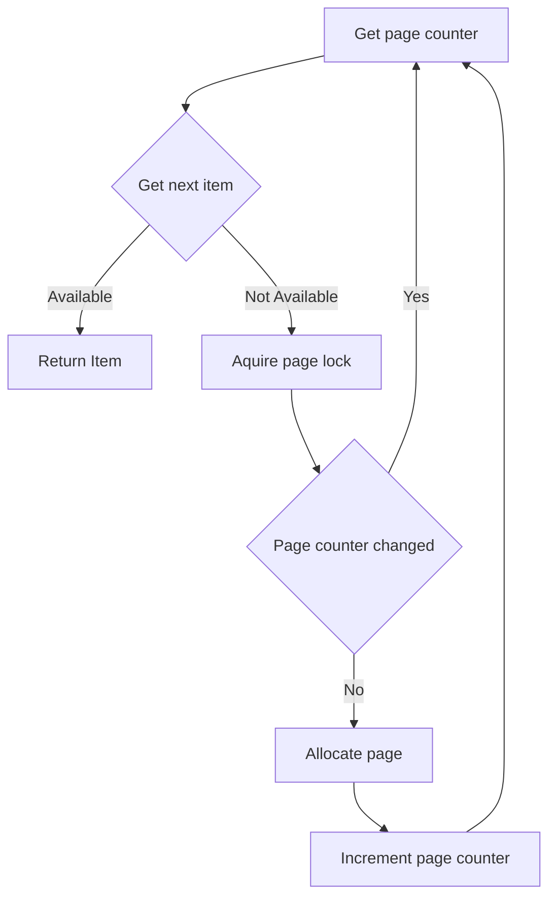

# Segregated Storage (C++)

[](https://github.com/andatr/segregated_storage/actions/workflows/linux.yml)
[](https://github.com/andatr/segregated_storage/actions/workflows/windows.yml)
[](https://github.com/andatr/segregated_storage/actions/workflows/macos.yml)

Segregated storage is a memory management technique that divides memory into separate regions, each dedicated to objects of a specific size, to optimize allocation, deallocation, and reuse of memory.

This functionally is implemented in the `RawSegregatedStorage` class, which allows allocation of fixed-size chunks of `std::byte`.
The `RawSegregatedStorage` class internally manages a list of fixed-size pages.
Each page contains a predetermined number of items, which together form a lock-free stack of items available for allocation.  
- When an item is allocated, it is taken from the stack.
- Conversely, when an item is deallocated, it is returned to the stack and can be reused.
- If the stack is empty, a new page is allocated, and its items are added to the stack.
Item acquisition is lock-free, while the page allocation process occurs under a lock, as detailed in the description below.
Allocated pages are retained in memory until the pool is destroyed (this optimization pattern is commonly used in standard containers like `std::vector`).

```
     ┌───────────┐  ┌────┐ ┌───┐ ┌───┐  ┌──────────┐  ┌────┐ ┌───┐ ┌───┐      
     │           ▼  │    ▼ │   ▼ │   ▼  │          ▼  │    ▼ │   ▼ │   ▼      
     │        ┌─────────────────────────────┐    ┌────────────────────────────┐
     │        │ ┌─────┐ ┌─────┐     ┌─────┐ │    │┌─────┐ ┌─────┐     ┌─────┐ │
Item Stack    │ │Item1│ │Item2│ ... │ItemN│ │    ││Item1│ │Item2│ ... │ItemN│ │
              │ └─────┘ └─────┘     └─────┘ │    │└─────┘ └─────┘     └─────┘ │
              │                             │    │                            │
Page List  ─► │          PAGE1              │ ─► │         PAGE2              │
              └─────────────────────────────┘    └────────────────────────────┘
```

For a higher-level approach, `SegregatedStorage<T>` and `SegregatedMultiStorage` classes can be used.

`SegregatedStorage<T>` extends `RawSegregatedStorage` by providing methods to allocate objects of type `<T>`, instead of chunks of raw data.  
It also ensures that constructors and destructors are called each time an object is allocated or deallocated.

`SegregatedMultiStorage` provides high-level interface as well, but unlike `SegregatedStorage<T>`, it can allocate objects of different types, attempting to place them on the same pages if they have the same size and alignment requirements.  
This approach allows better memory utilization with minimal synchronization overhead.  
Most object allocations remain non-blocking; however, the first allocation of a unique size and alignment combination incurs a blocking operation (in addition to page allocation).  

## Features:

1. **Lock-free Allocation/Deallocation:** 
  - The library is thread-safe, with object allocation and deallocation being mostly lock-free.

2. **Alignment Handling:**  
  - Ensures correct object alignment, supporting architectures with strict alignment requirements (e.g., for SIMD instructions).

3. **Grouping:**  
  - Groups objects with identical size and alignment requirements, optimizing memory usage.

## Requirements:

- **C++20 or higher** is required.

## Page allocation algorithm:



Since item allocation is lock-free, situations may arise where a thread fails to find an item to allocate, while another thread allocates a new page immediately after, but before the current thread requests a new page.
The simplest solution would be to make the page list a lock-free structure, allowing both threads to allocate pages simultaneously.
However, this approach would be too greedy.
Therefore, the decision was made to put page allocation under a lock and check if a new page is still required after the lock is acquired.
To implement this mechanism a `page counter` atomic field was introduced:
- A thread reads the `page counter` **before** checking for an available item.
- After acquiring the page lock, it checks the `page counter` again.  
- If the `page counter` has changed, the thread restarts the search for an available item.
- If the `page counter` has not changed, the thread proceeds to allocate a new page.
The `page counter` is incremented as the **last step** in the page creation process.  
This ensures proper synchronization and prevents unnecessary page allocations.

## Motivation

This library was inspired by `boost::object_pool` and was written as an exercise in creating a thread-safe version using modern C++ features.  
The original `boost::object_pool` was developed over 20 years ago, during a time when C++ lacked robust mechanisms for handling memory alignment.  
This implementation aims to address those limitations while leveraging modern C++ capabilities for improved performance in multi-threaded environments.